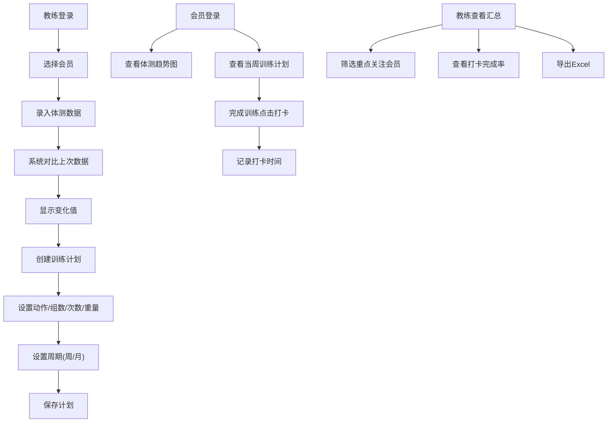

## 1. 产品概述

健身房会员体测记录与训练计划工具，为教练和会员提供体测数据管理、训练计划制定与执行、训练打卡跟踪的一体化解决方案。帮助教练高效管理会员健康数据，提升训练效果追踪能力；让会员清晰了解自身身体变化和训练进度。

- 核心用户：健身房教练、健身会员
- 目标价值：数字化体测管理、可视化训练进度、提升会员留存率

## 2. 核心功能

### 2.1 用户角色

| 角色 | 登录方式 | 核心权限 |
|------|----------|----------|
| 教练 | 角色切换 | 录入体测数据、创建训练计划、查看会员汇总、导出Excel、查看打卡完成率 |
| 会员 | 角色切换 | 查看体测趋势图、查看当周训练计划、训练打卡 |

### 2.2 功能模块

1. **首页/角色切换**：教练/会员角色快速切换入口，显示当前角色概览
2. **教练端 - 会员列表**：所有会员体测汇总，支持筛选重点关注会员
3. **教练端 - 体测录入**：录入新体测数据，自动对比上次数据显示变化
4. **教练端 - 训练计划**：为会员创建训练计划，支持按周/月周期重复
5. **教练端 - 打卡统计**：查看会员打卡完成率
6. **教练端 - 数据导出**：导出会员体测数据为Excel
7. **会员端 - 体测趋势**：体重、体脂率历史变化曲线图
8. **会员端 - 训练计划**：当周训练计划查看与打卡

### 2.3 页面详情

| 页面名称 | 模块名称 | 功能描述 |
|----------|----------|----------|
| 首页 | 角色切换面板 | 教练/会员角色切换，显示角色概览统计卡片 |
| 会员列表页 | 会员汇总表格 | 显示所有会员最新体测数据，支持按体重反弹、体脂超标筛选 |
| 会员列表页 | 会员搜索/筛选 | 按姓名搜索，按重点关注条件筛选 |
| 体测录入页 | 体测数据表单 | 录入体重、体脂率、胸围、腰围、臀围、心率 |
| 体测录入页 | 数据对比展示 | 自动计算并显示与上次体测的变化值（正负颜色区分） |
| 体测历史页 | 历史记录列表 | 会员历次体测数据时间线 |
| 训练计划页 | 计划创建表单 | 添加训练动作、组数、次数、重量，设置周期（周/月） |
| 训练计划页 | 计划列表 | 显示已创建的训练计划，支持编辑删除 |
| 打卡统计页 | 完成率仪表盘 | 各会员打卡完成率可视化展示 |
| 体测趋势页 | 折线图 | 体重、体脂率随时间变化的双折线图 |
| 当周训练页 | 训练卡片列表 | 本周每日训练计划，支持打卡操作，显示打卡状态和时间 |

## 3. 核心流程

教练工作流程：登录→选择会员→录入体测数据→系统对比显示变化→创建训练计划→设置周期→查看会员汇总→导出数据/查看打卡率

会员使用流程：登录→查看体测趋势图→查看当周训练计划→完成训练后点击打卡→查看打卡记录

## 4. 用户界面设计

### 4.1 设计风格
- **主色调**：深绿色(#166534) 代表健康活力，搭配橙色(#f97316) 作为强调色
- **背景色**：浅灰绿色渐变背景，营造清新健康氛围
- **按钮风格**：圆角胶囊按钮，悬浮有微放大效果
- **字体**：标题使用 Poppins，正文使用 Noto Sans SC
- **布局风格**：卡片式布局，侧边导航 + 主内容区
- **图标风格**：线性图标，配合微妙填充色

### 4.2 页面设计概览

| 页面名称 | 模块名称 | UI元素 |
|----------|----------|--------|
| 首页 | 角色切换面板 | 大卡片式角色选择，统计数据展示，渐变背景 |
| 会员列表页 | 会员汇总表格 | 数据表格带状态标签，颜色区分异常值，筛选工具栏 |
| 体测录入页 | 数据对比展示 | 表单输入框，对比数值显示（绿色下降/红色上升箭头） |
| 体测趋势页 | 折线图 | 带数据点的平滑双折线图，图例切换，时间轴 |
| 当周训练页 | 训练卡片列表 | 按日期分组的卡片，打卡按钮有动态反馈效果 |
| 打卡统计页 | 完成率仪表盘 | 环形进度图配百分比数字，渐变填充 |

### 4.3 响应式
- 桌面端优先设计（1280px+）
- 平板端：侧边栏收起为图标模式
- 移动端：底部Tab导航，卡片单列布局

### 4.4 动效设计
- 页面切换：淡入 + 轻微上移动画
- 数据变化：数字滚动动画
- 打卡按钮：点击后缩放 + 对勾飞入动画
- 图表加载：数据点依次出现的绘制动画
