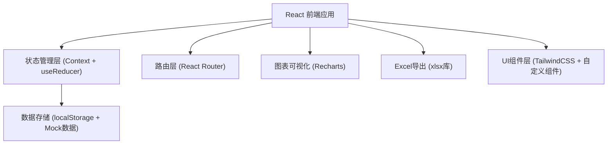
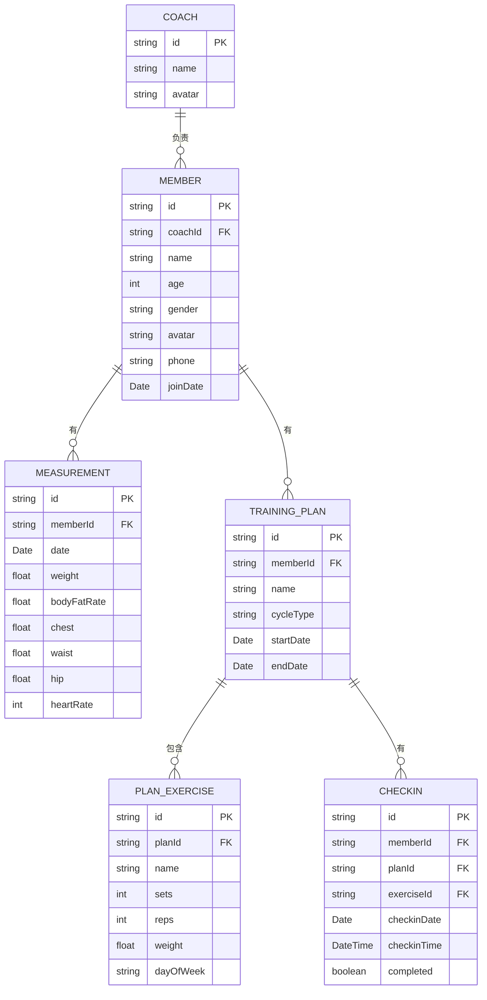

## 1. 架构设计



## 2. 技术描述

- **前端框架**：React@18 + TypeScript@5 + Vite@5
- **样式方案**：TailwindCSS@3 + PostCSS
- **路由管理**：React Router@6
- **状态管理**：React Context API + useReducer（轻量级全局状态）
- **数据持久化**：localStorage（无需后端）
- **图表库**：Recharts（体测趋势图、打卡完成率）
- **Excel导出**：xlsx (SheetJS)
- **图标库**：Lucide React
- **日期处理**：date-fns
- **初始化工具**：Vite (npm create vite@latest)

## 3. 路由定义

| 路由 | 页面组件 | 用途 |
|------|----------|------|
| / | HomePage | 首页 - 角色切换入口 |
| /coach/members | CoachMembersPage | 教练端 - 会员列表与体测汇总 |
| /coach/members/:id/measurements | CoachMeasurementPage | 教练端 - 会员体测录入 |
| /coach/members/:id/plans | CoachPlanPage | 教练端 - 训练计划管理 |
| /coach/checkin-stats | CoachCheckinPage | 教练端 - 打卡完成率统计 |
| /member/trends | MemberTrendsPage | 会员端 - 体测历史趋势图 |
| /member/weekly-plan | MemberWeeklyPlanPage | 会员端 - 当周训练计划与打卡 |

## 4. 数据模型

### 4.1 数据模型定义 (ER图)



### 4.2 TypeScript 类型定义

```typescript
type Role = 'coach' | 'member';

interface Coach {
  id: string;
  name: string;
  avatar: string;
}

interface Member {
  id: string;
  coachId: string;
  name: string;
  age: number;
  gender: 'male' | 'female';
  avatar: string;
  phone: string;
  joinDate: string;
}

interface Measurement {
  id: string;
  memberId: string;
  date: string;
  weight: number;
  bodyFatRate: number;
  chest: number;
  waist: number;
  hip: number;
  heartRate: number;
}

interface PlanExercise {
  id: string;
  planId: string;
  name: string;
  sets: number;
  reps: number;
  weight: number;
  dayOfWeek: number;
}

interface TrainingPlan {
  id: string;
  memberId: string;
  name: string;
  cycleType: 'weekly' | 'monthly';
  startDate: string;
  endDate: string;
  exercises: PlanExercise[];
}

interface Checkin {
  id: string;
  memberId: string;
  planId: string;
  exerciseId: string;
  checkinDate: string;
  checkinTime: string;
  completed: boolean;
}

interface MeasurementDiff {
  weight: number;
  bodyFatRate: number;
  chest: number;
  waist: number;
  hip: number;
  heartRate: number;
}
```

## 5. 项目目录结构

```
src/
├── components/
│   ├── common/
│   │   ├── Layout.tsx
│   │   ├── Sidebar.tsx
│   │   ├── StatCard.tsx
│   │   ├── DiffBadge.tsx
│   │   └── Button.tsx
│   ├── coach/
│   │   ├── MemberTable.tsx
│   │   ├── MemberFilter.tsx
│   │   ├── MeasurementForm.tsx
│   │   ├── MeasurementHistory.tsx
│   │   ├── PlanForm.tsx
│   │   ├── PlanList.tsx
│   │   └── CheckinRateChart.tsx
│   └── member/
│       ├── TrendChart.tsx
│       ├── WeeklyPlanCard.tsx
│       └── CheckinButton.tsx
├── context/
│   ├── AppContext.tsx
│   └── types.ts
├── data/
│   └── mockData.ts
├── pages/
│   ├── HomePage.tsx
│   ├── coach/
│   │   ├── CoachMembersPage.tsx
│   │   ├── CoachMeasurementPage.tsx
│   │   ├── CoachPlanPage.tsx
│   │   └── CoachCheckinPage.tsx
│   └── member/
│       ├── MemberTrendsPage.tsx
│       └── MemberWeeklyPlanPage.tsx
├── utils/
│   ├── storage.ts
│   ├── export.ts
│   └── date.ts
├── hooks/
│   └── useAppContext.ts
├── App.tsx
├── main.tsx
└── index.css
```
